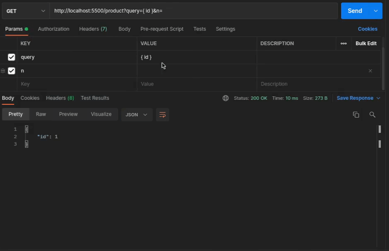

# QMap


Es un motor para manipulación JSON.

> Este paquete está bajo construcción, por lo que realizar
> más tests en `src/engine/engine.test.ts` es de gran
> ayuda para verificar que funcionen correctamente las
> capacidades actuales.



## Contenido
- [Motivación](#motivación)
- [Progreso](#progreso)
- [Capacidades](#capacidades)
- [Uso](#uso)
    - [Crear instancia qmap](#crear-instancia-de-qmap)
    - [Consultas](#consultas)
        - [Selección](#selección)
        - [Acceso](#acceso)
        - [Renombrar](#renombrar)
        - [Agregar todo](#agregar-todo)
        - [Excluir](#excluir)
        - [Funciones](#funciones)
            - [Por item en el array](#por-item-en-el-array)
        - [Spread (no provoca cambios en el JSON)](#spread)
    - [Ejecutar la query](#ejecutar-la-query)
> **Importante:** asegúrese de ver la nota al inicio de [Ejecutar la query](#ejecutar-la-query)
> sobre los `schemas`.

## Motivación
JSON es una de las formas más ampliamente utilizadas para
intercambiar información mediante HTTP, una característica
con la que se debe lidiar es qué información se debe mandar
como respuesta, las aplicaciones consumen la información
de muchas maneras y eso resulta en que a veces no es necesaria
toda la que nos pueda entregar un endpoint,
para llevar esto, simplemente se puede ignorar
y siempre obtener toda la información (en caso de ser utilizadas
con datos móviles es un derroche), o tal vez crear filtros con
los que se pueda minimizar el problema, la cuestión, es que esto
provoca tener que mantener más código.

QMap permite por medio de la declaración de queries manipular
el contenido del JSON, dando flexiblilidad a lo que
se puede consumir de un endpoint (la forma en
que se envía la query depende del desarrollador, por ejemplo,
para un endpoint GET simplemente puede mandarse como un query string,
además que si es `null` **qmap** devuelve el mismo objeto,
es decir que no lo modifica), también
agrega el poder de restringir y disminuir el tamaño
de las queries. El lado de la restricción se obtiene al declarar
`schemas` (opcionales) que indican un límite sobre lo que se
puede extraer del JSON, por ejemplo al indicarle que use el
schema **user** la información disponible sería diferente a la
que si usara **admin** (los nombres los define el desarrollador,
véase [schemas](#utilizando-schemas)), esto da la flexibilidad
de cambiar de un enfoque de "se incluyen los datos
porque el rol así lo define" a un "se debe incluir
la información?" y ya es la librería la que se encarga
de filtrar la información que puede o no consultar. Por otra parte
la disminución del tamaño es consecuencia de que en el lado del
servidor se pueden declarar queries, el cliente puede realizar
una consulta sobre una query ya definida y sólo modificar
lo que le interese (véase [queries](#utilizando-queries)).

Otro problema puede nacer al consumir APIs de terceros, por ejemplo,
si esta devuelve:
```json
{
  "id": "1",
  "price": 2.3,
  "description": "..."
}
```
pero el sistema únicamente necesita el precio para poderlo
mostrar, puede de una forma declarativa transformarlo a:
```javascript
const query = `{ currency(price) }`

const result = {
  "price": "$2.30"
}
```

> Puede consultar [Uso](#uso) para más información.

En la documentación se toma el enfoque de consumo
de información por medio de HTTP, pero la librería
no depende de nada del protocolo, por lo que puede
usarla dónde prefiera, siempre y cuándo exista
un JSON al cuál modificar.

## Progreso
- [x] Motor principal
- [ ] Motor modo cliente (en este se ejecuta parcialmente y crea
    una query minificada)
- [ ] Aplicar selección al resultado de la función

## Capacidades
- Limitación por medio de `schemas`
- Predefinición de queries, por medio de `queries`
- Declaración de funciones, por medio de `functions`
- Selección de campos
- Renombrar campos
- Reutilización de queries
- Accesos a campos internos (para aplanarlos o utilizarlos
    en una función)
- Funciones con o sin variables
- La capacidad de aplicar `array queries`
    - Selección
    - Acceso
    - Se pueden aplicar las funciones a los elementos
        del array.

## Uso
### Crear instancia de QMap
La forma más simple es llamar a `qmapCreator()`:
```javascript
import { qmapCreator } from "@qmap/engine"

const qmap = qmapCreator()
```

El resultado de ejecutar `qmapCreator()` es la función
de compilación de queries, la cuál al ser ejecutada
devuelve:
- La función `apply` que aplica la consulta a un objeto.
- La función `includes` que permite comprobar si el `path`
está en la consulta.
- El array `errors` que contiene los errores de compilación

> Véase [Ejecutar query](#ejecutar-la-query) para mayor información

<hr>

`qmapCreator()` puede recibir un objeto llamado `descriptor`,
en este se puede definir lo siguiente:

#### Utilizando `functions`
Para poder utilizar funciones dentro de la query, agregue las
definiciones al objeto que recibe `qmapCreator`:
```javascript
import { qmapCreator } from "@qmap/engine"

const qmap = qmapCreator({
  functions: {
    upperCase: (str) => str.toUpperCase()
  }
})
```
Las queries compiladas con la función `qmap` tendrán disponible
`upperCase`.

#### Utilizando `schemas`
Al tener un servicio que cuenta con varios niveles de
autorización se puede incurrir en tener condicionales para
seleccionar que datos se deben incluir según el rol, lo que
significa que si se agrega un nuevo rol habrá que cambiar
el código interno del endpoint, **qmap** tiene como propósito
no enfocarse en que información tiene que poder consultar cada
usuario, sino en que es lo que se quiere, por lo que los
condicionales pueden cambiar su enfoque de **"el rol tiene
acceso a"**, a **"se van incluir en lo consultado?"**,
la librería se encarga de filtrar la información según lo
declarado (véase [función includes](#includes-function)).

```javascript
import { qmapCreator } from "@qmap/engine"

const qmap = qmapCreator({
  schemas: `{
    admin {
      transaction, product, provider
    },
    client {
      transaction {
        description, amount, date
      },
      product {
        name
      }
    }
  }`
})
```
En este ejemplo el administrador puede consultar
toda la información en **transaction**, **product** y **provider**
sin embargo, el cliente puede ver únicamente **transaction** y
**product**, además que se le restringe que información puede consultar,
**transaction** se limita a **description, amount y date**, y del **product**
únicamente a **name**.

Si tiene trozos repetidos puede reutilizarlos usando `spread`:

```javascript
import { qmapCreator } from "@qmap/engine"

const qmap = qmapCreator({
  schemas: `{
    client {
      transaction,
      product
    },
    admin {
      ...client,
      provider
    }
  }`
})
```

En lo anterior el cliente tiene acceso total a **transaction** y
**product**, como el administrador también los tiene simplemente
se puede utilizar el operador `spread` para copiar lo que ya se definió
antes (debe estar declarado antes). Algo que por
el momento no se ha mencionado, pero es importante, es que
el `spread` funciona únicamente en el scope de la query (el string)
por lo que aunque se use `extends` no podrá utilizarlo con los
`schemas` o `queries` del qmap padre.

#### Utilizando `queries`
Permite predefinir manipulaciones del JSON que pueden ser modificadas
por medio de la query que se manda a ejecutar.

```javascript
import { qmapCreator } from "@qmap/engine"

const qmap = qmapCreator({
  queries: `{
    compact_transaction {
      description: transaction.description,
      amount: transaction.amount,
    }
  }`
})
```

Las queries compiladas con la función `qmap` podrá hacer
uso del nombre `compact_transaction` para referirse a dicha
query.

#### Utilizando `extends`
Permite reutilizar `functions`, `queries` y `schemas` de
otras instancias ya creadas. Lo definido en la instancia
actual, sobreescribe el comportamiento de las anteriores
(únicamente para la nueva instacia).

```javascript
import { qmapCreator } from "@qmap/engine"

const qmapCommon = qmapCreator({
  functions: {
    concat(...strs) {
      return strs.join("")
    },
    take(list, n) {
      return list.slice(0, n)
    },
    upperCase(str) {
      return str.toUpperCase()
    }
  }
})

const qmapProducts = qmapCreator({
  extends: qmapCommon,
  schemas: `{
    admin {
      ... // puede consultar todo
      // también podría no definirlo
    },,
    client {
      name,
      price
    }
  }`
})
```

> `qmapCreator` compila la query de `schemas` y `queries`
> al ejecutarse (es decir que la instancia devuelta para
> ejecutar queries ya no las vuelve a compilar)
> por lo que dejar la llamada a `qmapCreator` en
> dónde no se vuelva a ejecutar será una buena elección.

### Consultas
La estructura de una consulta se define de la siguiente
forma:

```javascript
const query = "NOMBRE_QUERY { }"
```

`NOMBRE_QUERY` es opcional y debería ser un nombre declarado
en la sección `queries` de `qmapCreator`, si el nombre existe
en la instancia de `qmap` se aplica primero para filtrar la información,
luego el resultado es usado para la query dentro de las llaves.

Cuándo la **query** es `null`, `undefined`, `""` o `"{}"`, el objeto
no es modificado (teniendo en cuenta que sería un parámetro
opcional en la petición de HTTP, significaría que se quiere toda la
información que pueda entregar el endpoint).

> **Importante:** si se van a declarar acciones sobre el JSON estas deben
> ir dentro de las llaves (`{}`), la única excepción es el nombre
> de la consulta padre (`NOMBRE_QUERY`).

#### Selección
```javascript
const query = `{
    id,
    description,
    provider {
        name
    },
    "un campo extra"
}`
```
Permite seleccionar que información se va incluir en el
resultado. Si una llave declarada en la selección no existe,
el valor será `null`.

- No hay límite en la anidación de la selección.
- Si no existe una selección sobre la llave se trae
toda la información sin modificar.
- No se permite dejar las llaves en blanco, es decir `provider {}`
es considerado un error.
- Si el contenido de la llave es un arreglo, la selección es aplicada
a los elementos.
- Las claves sin comillas son valores que cumplen con la expresión regular
`[a-zA-Z_$][a-zA-Z0-9_$]*`.
- Si una clave no cumple con la expresión regular anterior, se debe declarar
entre comillas (`""`), por ejemplo `"value 1"`.

### Acceso
Permite aplanar el JSON, también puede ser útil para usarse
con las funciones.
```javascript
const query = `{
    product.name,
    transaction.provider {
        id, name
    }
}`
// el resultado será
const result = {
    product_name: "...",
    transaction_provider: {
        id: 2,
        name: "test"
    }
}
```
- Admite cualquier nivel de acceso
- El nombre por defecto es la concatenación de
los valores separados por punto.
- Se permite utilizar las claves con comillas (`""`)
- Funciona en arrays, e.g.
```javascript
const input = {
    products: [
        { name: "pencil" },
        { name: "paper" },
    ],
    transaction: {
        providers: [
            { id: 1, name: "test" },
        ]
    }
}

const query = `{
    products.name,
    transaction.providers.id
}`

// el resultado será
const result = {
    products_name: [ 'pencil', 'paper' ],
    transaction_providers_id: [ 1 ]
}
```

Cualquier clave puede referirse a un arreglo y no se restringe
la cantidad de arreglos admitidos, tenga cuidado de no resultar
con arreglo de arreglos, si esto no es lo que necesita.

```javascript
const input = {
  objects: [
    { id: 1, objects: [{ value: 10 }, { value: 15 }] },
    { id: 2, objects: [{ value: 20 }, { value: 25 }] },
  ]
}

const query = `{
  result: objects.objects.value
}` // { result: [ [ 10, 15 ], [ 20, 25 ] ] }
```

Tampoco requiere que los datos sean del mismo tipo
(por favor, no se asuste xD):

```javascript
const input = {
  objects: [
    {
      objects: [
        { value: 10 }, { values: [{ value: 40 }] }
      ]
    },
    { objects: { values:  { value: 30 }  } },
  ]
}

const query = `{
  result: objects.objects.values.value
}` // { "result": [ [ null, [ 40 ] ],30 ]}
```

### Renombrar
Sirve para reemplazar el nombre que tiene por defecto una consulta
(en la selección es el mismo nombre de la clave, en el acceso es
la concatenación y en las funciones es la concatenación de los
nombres de los parámetros).

```javascript
const query = `{
    alias: "my query" {
        id, name
    },
    other: other."field in".object,
    result: upperCase(text)
}`
```

### Agregar todo
```javascript
const query = `{
    ...
}`
```
Este operador copia todos los valores del JSON de
entrada al resultado. Es de utilidad cuándo no se requiere filtrar
información sino que modificar algunos valores.

### Excluir
Permite eliminar valores del resultado, es de
utilidad en combinación con el operador `...`:

```javascript
const query = `{
    ...,
    !serial,
    id: serial
}`
```
En este caso es necesario borrar `serial` ya que el operador
`...` ya lo ha incluido en el resultado.

- Se declara como `!KEY`, dónde `KEY` es una clave en el resultado
(no en el JSON de entrada).
```javascript
const query = `{
    !serial,
    ...,
    id: serial
}` // !serial no afecta al resultado

const query = `{
  ...,
  id: product.id,
  !id
}` // se ha eliminado el campo renombrado
```
- Se pueden usar claves con comillas `""`

> Tenga cuidado!, como se ha comentado **exclude** no está limitado
> a borrar lo agreado por `...`

### Funciones
Debe declararlas en el `qmapCreator`, luego de esto
puede utilizar el nombre de la función dentro de la query,
debe ser un identificador válido, no es permitido utilizar
`""` para el nombre de las funciones.

- El nombre que toma la key en el resultado, es la concatenación de los
argumentos.
- Las funciones se aplican sobre los valores en el JSON de entrada
(no sobre los valores incluidos en el resultado).
```javascript
const query = `{
    toString(id)
}`
```
- Se pueden componer
```javascript
const query = `{
    upperCase(fullname(first_name, last_name)),
}`
```
- Pueden utilizar variables (los primitivos no se permiten,
si necesita mandar información externa, utilice variables,
tampoco es permitido utilizar `""` para el nombre de variables) estas
se mandan através de `qmap` o `apply` (más adelante)

```javascript
const query = `{
    take(members, @quantity)
}`
```

> Las variables se declaran con un `@` al inicio, seguido de un identificador.
> **No** puede usar comillas `""`

- Pueden usarse dentro de la selección, sin embargo esto limita la información
que puede utilizar a la que existe dentro de la clave en el JSON
de entrada. También es permitido utilizar **selección** y
**acceso** como argumentos.

```javascript
const query = `{
    product {
        upperCase(provider.name)
    },
    transaction {
        calcTotal(products {
            price
        })
    }
}`
```

- Queda en responsabilidad del desarrollador controlar
errores en las funciones, ya que la función `apply` podría
fallar, también se debe tener en cuenta que los argumentos
pueden ser `null`.

- No se transforma la salida de la función, es decir que
puede devolver `undefined` si lo desea.

- Las funciones deben ser síncronas, pero podría ser útil
posteriormente agregar asíncronas.


#### Por item en el array
Por defecto las funciones toman el objeto, es decir
que se ejecutaría una sola vez y como argumento tendría el array,
para ejecutar la función por cada elemento debe llamar
su función de esta manera:

```javascript
const query = `{
    [ upperCase(products.name) ]
}`

const input = {
  products: [
    { name: "pencil" },
    { name: "paper" },
  ],
}

const result = {
  products_name: [ 'PENCIL', 'PAPER' ]
}
```

Al encerrar la función en corchetes `[]` se indica
que se debe aplicar a cada elemento en el arreglo.

1. Puede utilizar la composición (se pueden componer funciones
por elemento y normales):

```javascript
const query = `{
    take([ currency([ add(ids, offset) ]) ], @quantity)
}`

const input = {
    offset: 100,
    ids: [1, 2, 3, 4, 5],
}

const result = {
  ids_offset_quantity: [ '$101.00', '$102.00', '$103.00' ]
}
```
> Con la notación `[]` se asume que el primer argumento es
> array, los demás deben ser valores globales, es decir,
> que estén en el scope de la clave en el JSON de entrada
> o bien sean variables. Aunque los demás valores sean
> arreglos serán tratados como argumentos únicos.

### Spread
Este operador no provoca cambios en el JSON, sólo tiene
el objetivo de reutilizar declaraciones.

```javascript
const query = `{
    user {
        id,
        name,
        account {
            id
        }
    },
    professor {
        ...user,
        classes
    },
    account {
        ...user.account,
    }
}`
```
Sería lo mismo que tener
```javascript
const query = `{
    user {
        id,
        name,
        account {
            id
        }
    },
    professor {
        id,
        name,
        account {
            id
        },
        classes
    },
    account {
        id
    }
}`
```

Se copia según el scope, por lo que en el caso de que
exista un padre cercano con la dirección que se especificó
y otra al inicio de la query, se copiará la más cercana,
para especificar explicitamente que se parta desde la raíz
de la consulta, utilice `&`.
```javascript
const query = `{
    target { name },
    pub {
        target {
            other
        },
        person {
            ...&target
        }
    }
}`
```
Lo anterior es equivalente a:
```javascript
const query = `{
    target { name },
    pub {
        target {
            other
        },
        person {
            name
        }
    }
}`
```

### Ejecutar la query
`qmapCreator()` devuelve una función de compilación que puede
usar para compilar la query.

```javascript
const qmap = qmapCreator()

const { errors, apply, includes } = qmap("{ id, name }")
```

La función `qmap` también recibe un parámetro opcional,
que es un objeto dónde puede declarar el `schema` y
las `variables` por default, estás son sobreescritas
si se vuelven a definir en la función `apply`.

> **Importante:** si sobreescribe el `schema` en la
> función `apply` debe sobreescribirlo en la función
> `includes`, ya que sino van a diferir en comportamiento.

```javascript
const qmap = qmapCreator()

const { errors, apply, includes } = qmap(`{
    [ upperCase(products.name) ],
    transaction.providers.id,
    take([ currency([ add(ids, @offset) ]) ], @quantity)
}`, {
  variables: {
    quantity: 1,
    offset: 300,
  }
})
```

La ejecución de la función de compilación devuelve
un objeto que contiene: `errors`, `apply` e `includes`.

- `errors` es un array con los errores al compilar la query, es
`undefined` si no hay errores.
```javascript
import { qmapCreator } from "@qmap/engine"
const qmap = qmapCreator()
const { errors } = qmap("{ id, name }")
```
- `includes` es una función que permite comprobar si el `path`
(dónde está alojado un objeto dentro del JSON)
se debe agregar. Respeta a los `schemas` y a las
`queries` de `qmapCreator`, por lo que no importa si
está en la query que se compiló con la función `qmap`,
si el schema o la query no lo tienen,
el resultado será `false`. Existe un segundo
parámetro (opcional) que sirve para sobreescribir
el schema, si en `apply` declara nuevamente el
`schema` asegurese de sobreescribirlo también en
`includes`.

```javascript
import { qmapCreator } from "@qmap/engine"
const qmap = qmapCreator()

const { includes } = qmap(`{
    product {
        provider {
            account
        }
    }
}`)

// se necesita un array que representa el camino hacia lo
// que se pregunta
includes(["product"]) // true
includes(["product", "provider"]) // true
includes(["product", "provider", "account"]) // true
includes(["product", "provider", "id"]) // false
```
> `includes` utiliza un índice que se genera en compilación,
> si se tiene `schemas` o `queries` se realiza la búsqueda
> en los tres índices.

> La intención de esta función es que se puedan realizar
> operaciones de forma condicional, por ejemplo agregar
> un join si es necesario (ayuda a cambiar el enfoque
> en el caso de tener diferentes niveles de acceso a la información).

3. `apply` es la función que trasforma el JSON, recibe como
primer argumento el JSON objetivo, y como segundo (opcional)
las opciones, que es el objeto dónde se pueden agregar las
variables y sobreescribir el `schema` (cuidado con
sobreescribir el schema, asegúrese de hacerlo en ambos, `apply` e `includes`).

> Las variables pueden tener cualquier tipo de dato.

```javascript
import { qmapCreator } from "@qmap/engine"

const qmap = qmapCreator({
  functions: {
    concat: (...strs) => strs.join("")
  },
  schemas: `{
    user {
      name
    }
  }`
})

const { apply } = qmap(`{
  id,
  name,
  label: concat(id, @separator, name)
}`, {
  variables: {
    separator: "@"
  }
})

const input = {
    id: 1,
    name: "test",
    other: "other"
}

const result = apply(input)
// result is { id: 1, name: 'test', label: '1@test' }

const otherResult = apply(input, {
  schema: "user",
  variables: {
    separator: "-"
  }
})
// result is { id: null, name: 'test', label: '-test' }
```
